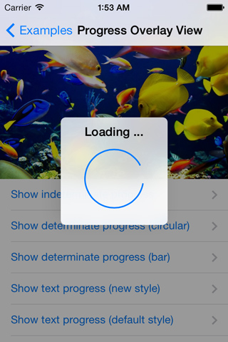
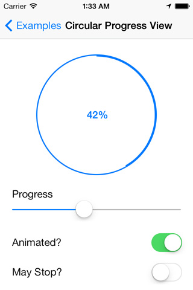
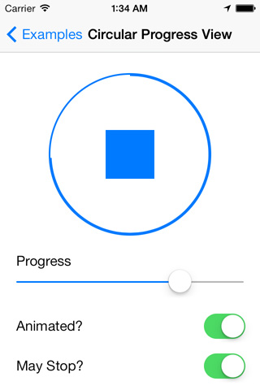
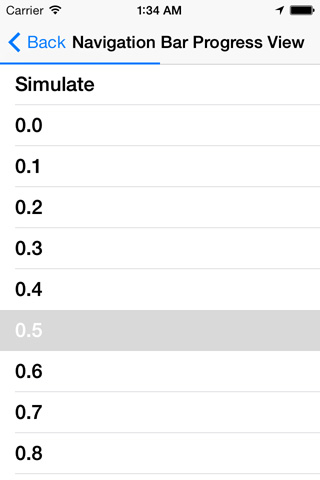
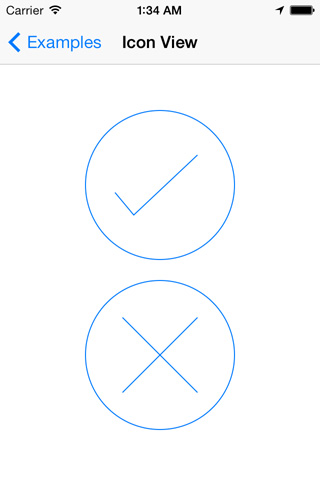
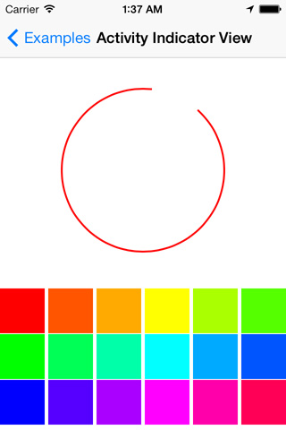

## MRProgress


MRProgress is a collection of drop-in components that display a dimmed overlay with a blurred box view with an indicator and/or labels while work is being done in a background thread.

[](Images/screenshot_004.png)
[](Images/screenshot_005.png)
[](Images/screenshot_006.png)
[](Images/screenshot_007.png)
[](Images/screenshot_008.png)
[](Images/screenshot_009.png)
[](Images/screenshot_010.png)

* **Component oriented**: You don't have to use all components or ```MRProgressOverlayView```. You can use just the custom activity indicators or progress views.
* **Configurable**: All components implement tintColor.
* **Customizable**: You can replace the given blur implementation and hook into your own you are maybe already using in other places of your app. Or simply throw in an [UIToolbar's layer](https://github.com/JagCesar/iOS-blur), if you prefer Apple's implementation. (Current blur implementation is as given by sample code of WWDC 2013.)
* **Reusable**: The code is fragmented in small reusable pieces.
* **Well documented**: You can install and open Appledoc documentation.


## Components

The components used in ```MRProgressOverlayView``` could be used seperately.
The provided Example app demonstrates how they can be used.

### ```MRProgressOverlayView```



* Supports different modes
* Animated show and hide
* Blured background
* With UIMotionEffects for tilting like ```UIAlertView```
* Supports multi-line title label text


### ```MRCircularProgressView```




* Circular progress view like in AppStore
* Inherits from ```UIControl``` and can display a stop button
* Animated with ```CADisplayLink```


### ```MRNavigationBarProgressView```



* Display a progress view in a ```UINavigationController```
* Hooks ```UINavigationControllerDelegate``` and is automatically removed on push or pop
* Can be used in ```UINavigationBar``` or ```UIToolbar```


### ```MRCheckmarkIconView``` and ```MRCrossIconView```



* Tint color can be changed
* Scalable
* Animatable
* Backed by ```CAShapeLayer```


### ```MRActivityIndicatorView```



* Tint color can be changed
* Same API as ```UIActivityIndicatorView```
* Animated with ```CABasicAnimation```


## Installation

### Cocoapods

[CocoaPods](http://www.cocoapods.org) is the recommended way to add MRProgress to your project.

1. Add a pod entry for MRProgress to your *Podfile* ```pod 'MRProgress', '~> 0.2'```.
2. Install the pod(s) by running ```pod install```.
3. Include MRProgress wherever you need it with ```#import "MRProgress.h"```.


### Source files

1. Download the [latest code version](http://github.com/mrackwitz/MRProgress/archive/master.zip) or add the repository as a git submodule to your git-tracked project.
2. Drag and drop the **src** directory from the archive in your project navigator. Make sure to select *Copy items* when asked if you extracted the code archive outside of your project.
3. Include MRProgress wherever you need any component with ```#import "MRProgress.h"```.


### Static library

1. Drag and drop **MRProgress.xcodeproj** in your project navigator.
2. Select your target and go to the *Build Phases* tab. In the *Link Binary With Libraries* section select the add button. On the sheet find and add libMRProgress.a.
3. Add Target **MRProgress** to your *Target Dependencies* list.
4. ```import <MRProgress/MRProgress.h>``` whereever you want to use the components. You could add it to your Prefix header file, if you want.


## Requirements

* Xcode 5
* iOS 7
* ARC
* Frameworks:
    * QuartzCore
    * CoreGraphics
    * Accelerate


## Usage

Check out the provided demo app for many examples how you can use the components.
Make sure you also see [MRProgress documentation on Cocoadocs](http://cocoadocs.org/docsets/MRProgress/).

### Basics

1. Add the following import to the top of the file or to your Prefix header:

   ```
   // If used with Cocoapods
   #import "MRProgress.h"
   ```
    
   ```
   // If used as Framework
   #import <MRProgress/MRProgress.h>
   ```

2. Use one the following ways to display the overlay:

   ```
   // Block whole window
   [MRProgressOverlayView showOverlayAddedTo:self.window animated:YES];
   ```
    
   ```
   // Block only the navigation controller
   [MRProgressOverlayView showOverlayAddedTo:self.navigationController.view animated:YES];
   ```
    
   ```
   // Block only the view
   [MRProgressOverlayView showOverlayAddedTo:self.view animated:YES];
   ```
    
   ```
   // Block a custom view
   [MRProgressOverlayView showOverlayAddedTo:self.imageView animated:YES];
   ```

3. Simply dismiss after complete your task:

   ```
   // Dismiss
   [MRProgressOverlayView dismissOverlayForView:self.view animated:YES];
   ```

### Modes

Name (```MRProgressOverlayView<...>```)  | Screenshot                                                      | Description
---------------------------------------- | --------------------------------------------------------------- | :-----------
**Indeterminate**                        | [](Images/screenshot_004.png) | Progress is shown using a large round activity indicator view. (```MRActivityIndicatorView```) This is the default.
**DeterminateCircular**                  | [](Images/screenshot_005.png) | Progress is shown using a round, pie-chart like, progress view. (```MRCircularProgressView```)
**DeterminateHorizontalBar**             | [](Images/screenshot_006.png) | Progress is shown using a horizontal progress bar. (```UIProgressView```)
**IndeterminateSmall**                   | [](Images/screenshot_007.png) | Shows primarily a label. Progress is shown using a small activity indicator. (```MRActivityIndicatorView```)
**IndeterminateSmallDefault**            | [](Images/screenshot_008.png) | Shows primarily a label. Progress is shown using a small activity indicator. (```UIActivityIndicatorView``` in ```UIActivityIndicatorViewStyleGray```)
**Checkmark**                            | [](Images/screenshot_009.png) | Shows a checkmark. (```MRCheckmarkIconView```)
**Cross**                                | [](Images/screenshot_010.png) | Shows a cross. (```MRCrossIconView```)


## Credits

MRProgress' API was inspired by [MBProgressHUD](https://github.com/jdg/MBProgressHUD) project.

The acquarium image was stolen by [Jag Cesar's blur implementation](https://github.com/JagCesar/iOS-blur).

You can find me on Twitter @mrackwitz.


## License

Copyright (c) 2013 Marius Rackwitz git@mariusrackwitz.de

The MIT License

Permission is hereby granted, free of charge, to any person obtaining a copy of this software and associated documentation files (the "Software"), to deal in the Software without restriction, including without limitation the rights to use, copy, modify, merge, publish, distribute, sublicense, and/or sell copies of the Software, and to permit persons to whom the Software is furnished to do so, subject to the following conditions:

The above copyright notice and this permission notice shall be included in all copies or substantial portions of the Software.

THE SOFTWARE IS PROVIDED "AS IS", WITHOUT WARRANTY OF ANY KIND, EXPRESS OR IMPLIED, INCLUDING BUT NOT LIMITED TO THE WARRANTIES OF MERCHANTABILITY, FITNESS FOR A PARTICULAR PURPOSE AND NONINFRINGEMENT. IN NO EVENT SHALL THE AUTHORS OR COPYRIGHT HOLDERS BE LIABLE FOR ANY CLAIM, DAMAGES OR OTHER LIABILITY, WHETHER IN AN ACTION OF CONTRACT, TORT OR OTHERWISE, ARISING FROM, OUT OF OR IN CONNECTION WITH THE SOFTWARE OR THE USE OR OTHER DEALINGS IN THE SOFTWARE.
